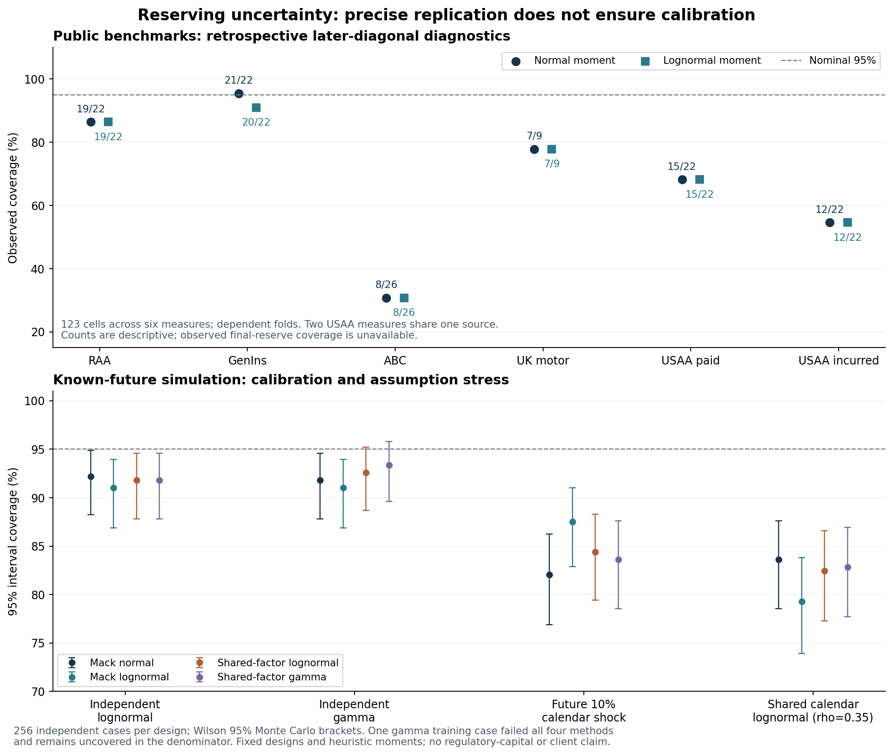

# Predictive reserving: uncertainty and calibration review

Independent AI-assisted portfolio research. Completed 2026-10-11. All amounts retain each published benchmark's units. This is not client claims data, a professional actuarial opinion or regulatory capital calibration.

## Decision finding

The original RAA replication remains correct: **55 observed cells**, IBNR **52,135.23**, aggregate Mack standard error **26,909.01**, nine external rounded origin standard-error references and the same **22 inspected later-diagonal forecasts**. Reproducing a standard error does not establish an entire predictive distribution or its calibration.

This registered extension compares six cumulative benchmark measures from five files, **123 eligible later-diagonal cells** and **23 eligible diagonal sums**. Point forecasts beat no-development MAE on all six measures, while nominal 95% moment intervals cover only **8/26 ABC cells**, **12/22 USAA incurred cells**, and **0/4 USAA paid eligible diagonal sums**. These are dependent retrospective diagnostics, not estimates of population coverage or observations of final reserve truth.

The controlled study executes all **1,024 fixed cases** across four data-generating designs. Four methods produce **4,092 scored rows** and **four retained failures** from one numerically degenerate gamma training case. Nominal 95% aggregate reserve intervals achieve only **79.3-83.6%** coverage with shared calendar innovations and **82.0-87.5%** under a future calendar shock. Stable independent designs also show imperfect finite-sample coverage. No method is declared calibrated or chosen as a winner after seeing the outcomes.



## Registration and immutable history

- Initial public source/design registration **3c75d8ed52c87eb09280325ab1ec9c32202d0746**, protocol SHA256 `5831006d6ad5a6be3199fe3f1927bd52609c7d8561f57e5ce06e00a4c499cfe7`, precedes collection of four new exact CSV blobs and primary execution. RAA and documentation examples, including some ABC summaries, were already inspected; no public benchmark is claimed as an untouched prospective holdout.
- Dependency integration amendment **12ad3aa2b2cbf94144782590ba865125f1a065ca** adds SciPy to the original requirements before the primary run. Initial historical CI failed solely because new predictive tests imported absent SciPy; the failure is retained in the protocol, not presented as a successful run.
- Computational amendment **95d17e708e7eec12642cd5faa7ca7c7df8c62296**, protocol SHA256 `49cd1c7bad5c2d8a1c72fd25cf2d7a5faa8b15e2c0a6002964fd8c8f54a98b01`, records the interrupted run's gamma numerical-zero handling and full-method failure recording. The first attempt emitted 320 case completions, then stopped; it produced no durable calibration case table. Seven completed public files remain byte-identical. No data, statistical family, factor/variance specification, seed, draw budget, score or case menu was changed based on results.
- All 28 original files remain present. **25 original blobs** are unchanged; README/evidence-review prose is extended and the original dependency file gains pinned SciPy. Historical source, 12 original tests, RAA outputs, synthetic benefits data and published workbook bytes remain unchanged. No old benchmark table is regenerated over its published bytes.

## Data lineage and eligibility

The source registry and blobs are pinned to `casact/chainladder-python` commit **856f87b5651004c799cf06704b8a9c3f7dd61d98**. The unmodified `genins.csv`, `abc.csv`, `ukmotor.csv` and `usaa.csv` blobs are verified by Git blob SHA1, byte length and recorded SHA256. Original `data/raa.csv` keeps its previous bytes and attribution. The source receipt retains the initial collection registration; later code amendments do not rewrite that collection history. MPL-2.0 and a source notice accompany redistributed samples.

RAA: 10 origins/55 cells; GenIns: 10/55; ABC: 11/66; UK motor: 7/28; USAA paid and incurred: 10/55 each. There are **six measures**, not six independent insurers: USAA paid and incurred share a source. No currency, employer/client identity or release-feasible historical access is invented. Convenience sample selection and old public availability limit generalization.

Every observed cumulative cell must be finite and positive with a complete annual triangular mask. Negative incremental development is retained: one negative RAA increment and **43** USAA incurred increments. USAA incurred's total projected reserve is **-755,258.40**, interpreted as negative development on an incurred benchmark, not negative future paid cash claims or a booked liability. Its positive-reserve lognormal approximation is explicitly unavailable; normal and cumulative-process simulations retain negative reserve outcomes.

## Methods and assumptions

For age k, ordinary volume-weighted chain ladder estimates `f = sum(Cnext)/sum(C)` and `sigma2 = sum(C*(Cnext/C-f)^2)/(pairs-1)`. The one-pair final age uses the existing conservative Mack extrapolation. Shared parameter covariance across origin reserves is retained in the original analytic aggregate standard error. Official implementations can instead use log-linear last-age extrapolation; their default aggregate error need not match this explicitly stated choice.

**One-step prediction:** for latest amount x, mean `x*f`, process variance `sigma2*x`, and estimated-factor variance `x*x*sigma2/sum(C)`. Normal and lognormal moment approximations share those two moments. The lognormal is applied to the next **positive cumulative amount**, allowing an implied negative increment. Central 80/95% intervals, upper 95% exceedances, widths and interval scores are reported. No endpoint is clipped to latest paid claims or zero.

**Full-reserve analytic approximation:** apply normal or, when mean reserve is positive, lognormal moments to aggregate reserve using the original Mack standard error. This is a shape assumption, not a distribution-free quantile theorem or a posterior. The normal RAA lower 2.5th percentile is negative and remains visible.

**Shared-factor moment simulation:** draw positive independent age factors with `E[f*]=f` and `Var[f*]=sigma2/sum(C)`. Each drawn age factor is shared by every origin reaching that age. Conditional gamma or lognormal cumulative transitions have `E[Cnext|C,f*]=f*C` and `Var[Cnext|C,f*]=sigma2*C`. All fitted sigma2 values remain fixed. This is **not** residual resampling, a parametric bootstrap, parameter posterior or proof that factor-estimation error has that distribution. It excludes dispersion-estimation and cross-age factor dependence. Those omissions help explain why it must be calibrated empirically before any stronger use.

Each public family uses **8,192 draws**. Parameter-only values are conditional expected reserves from the same factor draws; process-only projections hold fitted factors fixed and use separately seeded innovations. They are distinct uncertainty components, not separate independent studies or an additive decomposition obtained by subtracting noisy sample variances. For each factor draw, recursively compute conditional means and variances; `E[Var(reserve|f*)] + Var(E[reserve|f*])` supplies the law-of-total-variance decomposition. Its higher-order moment mixture need not equal Mack's analytic first-order formula.

Small-shape gamma draws may underflow to exactly zero in floating point. Such states are kept and become absorbing, with no floor, redraw or dropped trajectory. RAA combined gamma has **1,430 final zero-origin states** across 8,192 x 10 origin outcomes; process-only has **742**. These are origin-state counts, not 1,430 failed simulations or negative client claims. This numerical approximation is disclosed; lognormal RAA has none. Public quantile MC brackets use conservative binomial order ranks and assess simulation precision only. Even 8,192 draws do not validate a 99.5% capital quantile.

## Historical later-diagonal evaluation

For n origins, use valuation sizes `m=max(4,n-4),...,n-1`. Fit only the m x m observed upper triangle, `i+j<m`; use eligible origins `i=2,...,m-1`, so every forecast age has at least two historical age-pair observations. Predict the next known cumulative cell. Evaluation outcomes never fit factors or sigmas. Mutating a last-diagonal outcome leaves earlier forecasts/intervals unchanged in an independent test.

The aggregate target sums **only eligible cells**; it excludes a newly appearing origin and the oldest eligible age with only one fitted pair. It is not a full claims-development-result calculation. Every cell's fitted pair count, variance components and training-array hash are saved. The same 22 RAA predictions reconcile to the previously published rows; no fresh holdout label is attached.

| Measure | Cells | CL MAE | No-development MAE | Normal 95% covered | Lognormal 95% covered |
|---|---:|---:|---:|---:|---:|
| raa | 22 | 1,885.21 | 3,425.45 | 19/22 | 19/22 |
| genins | 22 | 215,171.82 | 756,082.82 | 21/22 | 20/22 |
| abc | 26 | 16,644.96 | 157,929.23 | 8/26 | 8/26 |
| ukmotor | 9 | 208.60 | 2,457.67 | 7/9 | 7/9 |
| usaa_paid | 22 | 35,446.91 | 150,251.64 | 15/22 | 15/22 |
| usaa_incurred | 22 | 51,206.95 | 75,893.23 | 12/22 | 12/22 |


MAE amounts are meaningful only within the same benchmark units. Coverage counts share triangle/fold dependence; no naive binomial population confidence interval, pooled cross-currency loss or industry-wide claim is made. The full table also reports 80% coverage, proper interval scores and eligible-diagonal results, including all failures of apparently precise forecasts.

## Controlled calibration with known realized future claims

Generate full 8-origin cumulative paths and reveal 36 observed triangular cells. First amounts are `[900,1080,1260,1440,1620,1800,1980,2160]`; age factors `[1.8,1.45,1.25,1.12,1.06,1.025,1.01]`; sigma2 `[600,240,100,40,16,6.4,2.56]`. The last true sigma2 agrees with the fixed geometric Mack extrapolation at the population values; finite-sample estimates still vary.

The actual target is realized full-horizon aggregate ultimate minus latest observed sum, including negative realized reserves where they occur. It is not the known mean reserve. Each design has **256 independently seeded cases**:

1. Independent positive lognormal cumulative transitions, matching the stated conditional moments.
2. Independent gamma transitions with the same moments. Case **69** has two observed numerical-zero cells; all four methods refuse invalid positive training and are counted uncovered. The true future is retained using the declared absorbing-zero rule.
3. Independent lognormal paths with a **10% mean-factor shock on the first unobserved calendar only**; variance remains `sigma2*C`, later factors stable. This unobservable shock challenges extrapolation; no fitted calendar model is implied.
4. Lognormal paths with shared same-calendar normal innovations, **rho=0.35**. Conditional cell means/variances remain specified while origin independence is violated. This is a stress design, not an estimated real insurer correlation.

Forecasts use only the observed triangle and **4,096 draws per shared-factor method per valid case**. All four methods share each case's outcomes. Seed IDs and budgets are frozen; Wilson brackets describe Monte Carlo uncertainty over independent **simulated cases**, not real-insurer coverage, a method-selection p-value or an asymptotic theorem. Failures remain in the coverage denominator; scores exclude them with their count/denominator explicit.

| Simulation design | Method | 80% covered / 256 | 95% covered / 256 | 95% coverage | Wilson MC bracket | Failed | Mean 95% interval score / latest |
|---|---|---:|---:|---:|---:|---:|---:|
| future_calendar_shock | mack_lognormal | 150 | 224 | 87.5% | 82.9-91.0% | 0 | 1.1146 |
| future_calendar_shock | mack_normal | 150 | 210 | 82.0% | 76.9-86.2% | 0 | 1.5101 |
| future_calendar_shock | shared_gamma | 151 | 214 | 83.6% | 78.6-87.6% | 0 | 1.3250 |
| future_calendar_shock | shared_lognormal | 152 | 216 | 84.4% | 79.4-88.3% | 0 | 1.3001 |
| independent_gamma | mack_lognormal | 194 | 233 | 91.0% | 86.9-93.9% | 1 | 0.8464 |
| independent_gamma | mack_normal | 200 | 235 | 91.8% | 87.8-94.6% | 1 | 0.9602 |
| independent_gamma | shared_gamma | 199 | 239 | 93.4% | 89.6-95.8% | 1 | 0.9029 |
| independent_gamma | shared_lognormal | 201 | 237 | 92.6% | 88.7-95.2% | 1 | 0.8978 |
| independent_lognormal | mack_lognormal | 197 | 233 | 91.0% | 86.9-93.9% | 0 | 0.7903 |
| independent_lognormal | mack_normal | 205 | 236 | 92.2% | 88.2-94.9% | 0 | 0.8830 |
| independent_lognormal | shared_gamma | 202 | 235 | 91.8% | 87.8-94.6% | 0 | 0.8476 |
| independent_lognormal | shared_lognormal | 200 | 235 | 91.8% | 87.8-94.6% | 0 | 0.8409 |
| shared_calendar_lognormal | mack_lognormal | 149 | 203 | 79.3% | 73.9-83.8% | 0 | 1.5256 |
| shared_calendar_lognormal | mack_normal | 157 | 214 | 83.6% | 78.6-87.6% | 0 | 1.6347 |
| shared_calendar_lognormal | shared_gamma | 157 | 212 | 82.8% | 77.7-86.9% | 0 | 1.5955 |
| shared_calendar_lognormal | shared_lognormal | 156 | 211 | 82.4% | 77.3-86.6% | 0 | 1.5815 |


These results do not support universal nominal coverage, including under independent designs. None of the methods is tuned or chosen from this comparison. No learned calendar coefficient or wider corrective interval is promoted on these already inspected evaluation cases.

## Tail and calendar sensitivity

| RAA reserve approximation | 2.5th | Median | 97.5th | 99.5th |
|---|---:|---:|---:|---:|
| mack_normal | -605.46 | 52,135.23 | 104,875.92 | 121,448.25 |
| mack_lognormal | 17,872.20 | 46,328.26 | 120,091.92 | 161,993.52 |
| lognormal_combined | 21,200.33 | 46,453.39 | 115,863.43 | 174,668.14 |
| gamma_combined | 19,431.80 | 45,747.02 | 123,339.21 | 166,994.35 |


These RAA values are model-implied/empirical approximation quantiles, not observed final-reserve quantiles. Family and parameter-risk representation change their tails even while matching local first two moments. Full raw draw arrays and order-statistic MC brackets are retained.

Deterministic tail factors **1.00/1.01/1.025/1.05** multiply all final-age ultimate values, including the oldest origin. RAA's 2.5% tail assumption adds **5,328.06** reserve units. The existing standard error is multiplied by the tail factor with **no added tail-estimation/process variance**; it must not be described as full uncertainty after tail modelling. No tail factor is selected as best.

Leverage-adjusted Mack residuals are tabulated by calendar and age with counts, means and standard deviations. These are descriptive diagnostics. No approximate calendar test is substituted for a validated dependence model, and a small residual pattern cannot prove stable future calendar behaviour.

## Alternatives and primary references

- [Mack (1993)](https://www.cambridge.org/core/journals/astin-bulletin-journal-of-the-iaa/article/distributionfree-calculation-of-the-standard-error-of-chain-ladder-reserve-estimates/E8D207F9A4DCE30300A76780FE510437) motivates conditional first/second moments and independent origins; [official Mack implementation](https://mages.github.io/ChainLadder/reference/MackChainLadder.html) states those assumptions and last-age/tail options.
- [Steinmetz and Jentsch (2023)](https://arxiv.org/abs/2303.05913) separates process/estimation bootstrap behaviour and the importance of parametric-family assumptions. The present heuristic does not claim to implement their alternative consistency result.
- [Official England/Verrall-style bootstrap implementation](https://mages.github.io/ChainLadder/reference/BootChainLadder.html) resamples scaled incremental residuals and separately simulates process uncertainty. That different ODP model needs explicit signed-increment handling; it is not silently relabelled as Mack or declared universally invalid on negative increments.
- [Official Cornish-Fisher quantiles](https://mages.github.io/ChainLadder/reference/quantile.MackChainLadder.html) use additional skewness estimation. Higher-moment, residual-bootstrap and explicit Bayesian/calendar alternatives remain meaningful next comparisons, not claims reproduced here.

The finite menu makes this comparison reproducible; it does not prove a globally optimal method. A defensible next step is to register a distinct development/confirmation design for dispersion and calendar-aware methods, with original-vintage insurer/exposure data and credible tail information. Benefits mortality/turnover and real plan rules remain separate gaps; synthetic workbook mechanics do not become qualified pension/health valuations through this reserving study.

## Reproduction and verification

```bash
python -m pip install -r requirements-predictive.txt
python -m pytest -q
python collect_predictive_sources.py --verify-committed
python verify_predictive_reserving.py
```

**37 tests** retain all 12 historical tests and add independent predictive checks: hand-counted one-step moments, conditional distribution moments, loss-preserving scores, negative normal endpoints/increments, failure denominator, future-fit isolation, fixed eligible counts, future-shock separation, deterministic seeds, zero-state retention and scale equivalence.

The strict verifier checks **27 core manifest files**, all public projections/draw arrays/scores, original RAA rows, every one of the **1,024 generated designs and realized targets**, all stored method scores and the complete calibration summary. It reexecutes **16 fixed cases**: IDs 0/85/170/255 in each of four designs. The original study executed all 1,024; CI refits 16, not all 1,024. Numerical replay uses rtol 2e-10 / atol 2e-8; differing training-byte hashes are separately counted, without a universal bit-identical hardware claim.

For a new full execution, use an empty output directory inside this repository:

```bash
python benchmark_predictive_reserving.py --output outputs/predictive_reproduction --workers 4
```

Completed study output cannot be overwritten. Resume is restricted to the exact seven public files of an interrupted calibration; final summaries block resume. Source/hash changes block execution with no alternative mirror or silent source substitution. Recreating the coverage figure needs optional `matplotlib==3.10.8`, then `python plot_predictive_reserving.py`; it reads completed tables and never refits.

The [predictive workflow](https://github.com/Prasanna-K-123/employee-benefits-actuarial-analytics/actions/workflows/predictive-reserving.yml) runs all tests and full registered replay on releases containing final results. Registration-only runs explicitly skip data replay before artifacts exist and are not cited as final study evidence. The unchanged [benefits workflow](https://github.com/Prasanna-K-123/employee-benefits-actuarial-analytics/actions/workflows/employee-benefits-actuarial-ci.yml) separately rebuilds/recalculates the Excel workbook and verifies historical Mack output. Exact successful release revisions/runs are linked from the current profile evidence guide after publication verification.
